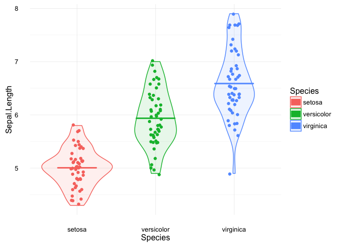

Tutorial R Notebook
================
Katherine Wood

This notebook is based loosely on [this cheatsheet](https://www.rstudio.com/wp-content/uploads/2016/03/rmarkdown-cheatsheet-2.0.pdf) that shows some of the most basic functionality of R notebooks, including code, markdown, and Latex.

Code
====

Chunks
------

You can imbed chunks of R code right into the notebooks and run them. Why not beat that long-dead horse of demo data, the iris dataset?

``` r
head(iris)
```

    ##   Sepal.Length Sepal.Width Petal.Length Petal.Width Species
    ## 1          5.1         3.5          1.4         0.2  setosa
    ## 2          4.9         3.0          1.4         0.2  setosa
    ## 3          4.7         3.2          1.3         0.2  setosa
    ## 4          4.6         3.1          1.5         0.2  setosa
    ## 5          5.0         3.6          1.4         0.2  setosa
    ## 6          5.4         3.9          1.7         0.4  setosa

If you print a dataframe, it automatically gets formatted in this nice way.

We can also look at the summary:

``` r
summary(iris)
```

    ##   Sepal.Length    Sepal.Width     Petal.Length    Petal.Width   
    ##  Min.   :4.300   Min.   :2.000   Min.   :1.000   Min.   :0.100  
    ##  1st Qu.:5.100   1st Qu.:2.800   1st Qu.:1.600   1st Qu.:0.300  
    ##  Median :5.800   Median :3.000   Median :4.350   Median :1.300  
    ##  Mean   :5.843   Mean   :3.057   Mean   :3.758   Mean   :1.199  
    ##  3rd Qu.:6.400   3rd Qu.:3.300   3rd Qu.:5.100   3rd Qu.:1.800  
    ##  Max.   :7.900   Max.   :4.400   Max.   :6.900   Max.   :2.500  
    ##        Species  
    ##  setosa    :50  
    ##  versicolor:50  
    ##  virginica :50  
    ##                 
    ##                 
    ## 

And of course, you can use whatever libraries you like, as usual. We can set an option in this chunk to disable the messages that print to the console when you do things like load libraries. We could also turn off warnings, set options for error handling, or specify how we want results and code interleaved, or if we want the code in the output document at all. Setting the `tidy` argument to `TRUE` also spiffs up your code for you (cleaning up multiline expressions with indenting, for instance) in the output. So customizable!

``` r
library(dplyr) #We could also have set the quietly argument to TRUE, but where's the fun in that
(meanpetals <- group_by(iris, Species) %>%
               summarize(length = mean(Petal.Length), width = mean(Petal.Width)))
```

    ## # A tibble: 3 × 3
    ##      Species length width
    ##       <fctr>  <dbl> <dbl>
    ## 1     setosa  1.462 0.246
    ## 2 versicolor  4.260 1.326
    ## 3  virginica  5.552 2.026

Boring old data demos never looked so fresh!

Inline
------

Inline code executes invisibly, so all you see is the output. For example, I can run a function right here and now to get the weekday:
Today is a Sunday.

You can also set global parameters in the header and reference them throughout the document.

This inline execution has various uses. If you need code primarily for its output, like getting the current date or weekday and adding it into text, then inline works really well and better than a chunk.

Displaying Data
===============

If you're writing up a tutorial or a report on results, you'll more likely than not need to display data in the form of plots and tables. This is super easy in R Notebooks, and there are lots of options.

Plots
-----

Let's see what the sepal lengths in Iris are up to by species, just for kicks. I'll do some more extensive data manipulation in a code chunk, just to show we can. Since I loaded dplyr in another code chunk further up, we're good there.

``` r
library(ggplot2)
iris_plot <- ggplot(data=select(iris, Species, Sepal.Length), 
                    aes(x=Species, y=Sepal.Length, color=Species, fill=Species)) +
  geom_violin(alpha=.1) +
  geom_point(position=position_jitter(w=.2)) +
  geom_crossbar(stat='summary',fun.y=mean, fun.ymax=mean, fun.ymin=mean, fatten=2, width=.5) +
  theme_minimal()
print(iris_plot)
```



Fascinating, I guess!

The nice thing about this is that these plots are completely reproduceable--they'll be generated everytime you run the notebook. You can keep the code cell that generates it in the output, so people can see it, or if you want a cleaner output with just the results, you can hide the generating code cell. You can tailor it to your options.

Tables
------

Tables can be a real pain-point when doing manuscripts, but these can be automated in R Notebooks, rendered right into text, and some look pretty good. Here's what `knitr` will give you (it won't look right until it's rendered):

``` r
knitr::kable(meanpetals)
```

| Species    |  length|  width|
|:-----------|-------:|------:|
| setosa     |   1.462|  0.246|
| versicolor |   4.260|  1.326|
| virginica  |   5.552|  2.026|

That looks alright!

There's also `xtable,` which will make it easier to set the appearance of the table through HTML attributes. This won't show up until it's rendered, though.

``` r
print(xtable::xtable(meanpetals), type='html', html.table.attributes='border=0  width=250')
```

<!-- html table generated in R 3.3.2 by xtable 1.8-2 package -->
<!-- Sun Mar  5 21:35:07 2017 -->
<table border="0" width="250">
<tr>
<th>
</th>
<th>
Species
</th>
<th>
length
</th>
<th>
width
</th>
</tr>
<tr>
<td align="right">
1
</td>
<td>
setosa
</td>
<td align="right">
1.46
</td>
<td align="right">
0.25
</td>
</tr>
<tr>
<td align="right">
2
</td>
<td>
versicolor
</td>
<td align="right">
4.26
</td>
<td align="right">
1.33
</td>
</tr>
<tr>
<td align="right">
3
</td>
<td>
virginica
</td>
<td align="right">
5.55
</td>
<td align="right">
2.03
</td>
</tr>
</table>
Finally, here's a table fron the `stargazer` package. Also lots of attributes we can set here. It's designed mostly for pretty formatting of regression model results and summary stats, but we can get it to do direct output instead.

``` r
stargazer::stargazer(as.data.frame(meanpetals), type='html', summary=F)
```

<table style="text-align:center">
<tr>
<td colspan="4" style="border-bottom: 1px solid black">
</td>
</tr>
<tr>
<td style="text-align:left">
</td>
<td>
Species
</td>
<td>
length
</td>
<td>
width
</td>
</tr>
<tr>
<td colspan="4" style="border-bottom: 1px solid black">
</td>
</tr>
<tr>
<td style="text-align:left">
1
</td>
<td>
setosa
</td>
<td>
1.462
</td>
<td>
0.246
</td>
</tr>
<tr>
<td style="text-align:left">
2
</td>
<td>
versicolor
</td>
<td>
4.260
</td>
<td>
1.326
</td>
</tr>
<tr>
<td style="text-align:left">
3
</td>
<td>
virginica
</td>
<td>
5.552
</td>
<td>
2.026
</td>
</tr>
<tr>
<td colspan="4" style="border-bottom: 1px solid black">
</td>
</tr>
</table>
If none of the formatting is quite to your liking, or you don't have easily available options to set, you can tweak the appearance with your [own CSS](http://rmarkdown.rstudio.com/html_document_format.html#custom_css).

If none of this is satisfying, or it's more informal, you can always just print the dataframe.

``` r
(meanpetals)
```

    ## # A tibble: 3 × 3
    ##      Species length width
    ##       <fctr>  <dbl> <dbl>
    ## 1     setosa  1.462 0.246
    ## 2 versicolor  4.260 1.326
    ## 3  virginica  5.552 2.026

I don't know that this makes tables any less painless, but at least now there's more than one option for the pain.

Formatting
==========

If you're writing up a report or manuscript, you also need your text to look nice, not just your data. This is where knowing a little bit of Markdown comes in handy.

Markdown
--------

Just type to get pretty plaintext. To quote `verbatim code` without running anything, wrap it in backticks(\`). This is distinct from inline code, which is prefaced with `r` within the ticks. I'll do this throughout to demonstrate how to construct the effects you see.

To display a special character, like \_underscores\_ or asterisks \*, escape them with a backslash (\\).

To add a single linebreak without a blank line, end a line with two spaces.`..`
Ta-da!

`*italics*`: *italics*
`**bold**`: **bold**
`**_both_**`: ***both***
`~~strikethrough~~`: ~~strikethrough~~
`subscript~1~`: subscript<sub>1</sub>
`superscript^2^`: superscript<sup>2</sup>

You can do bulleted lists:

`* start with an asterisk, plus, or minus` `+ then indent 4 spaces` `- then indent again` `* then more stuff`

-   start with an asterisk, plus, or minus
    -   then indent 4 spaces
        -   then indent again
-   then more stuff

And ordered ones:

`1. Big thing` `i) small thing \+ indent` `A. sub-small thing` `2. Another big thing`

1.  Big thing
    1.  small thing + indent
        A. sub-small thing

2.  Another big thing

Oh, and footnotes... `[^1]` [1]

`#Header 1`

Header 1
========

`##Header 2`

Header 2
--------

`###Header 3`

### Header 3

Add horizontal lines with at least three hyphens, asterisks, or underscores:

`***`

------------------------------------------------------------------------

Tables are a little strange in the raw, but look nice once rendered.

    | Right-aligned | Left-aligned | Centered | Default |
    |-:|:-|:-:|-|
    |1|1|1|1|
    |12|12|12|12| 
    |*1*|_2_|~~3~~|4^2^|

|  Right-aligned| Left-aligned | Centered | Default       |
|--------------:|:-------------|:--------:|---------------|
|              1| 1            |     1    | 1             |
|             12| 12           |    12    | 12            |
|            *1*| *2*          |   ~~3~~  | 4<sup>2</sup> |

Images are easy, too.
``


Latex and Equations
-------------------

Math formatting can be done with the same notation used in Latex.

To do inline equations or mathematical notation, use single dollar signs: `$f(x) = \frac{1}{x}$`. $f(x) = \\frac{1}{x}$

To do an equation block, use double dollar signs: `$$-b \pm \sqrt{\frac{b^2 - 4ac}{2a}}$$`
$$-b \\pm \\sqrt{\\frac{b^2 - 4ac}{2a}}$$

We can do Greek letters: `$\Sigma \; \alpha \; \gamma$`: *Σ* *α* *γ*

Sums, products, and integrals can be inline with inner limits: `$\sum_{i=1}^{\infty}x_i$` $\\sum\_{i=1}^{\\infty}x\_i$
Or inline with outer limits: `$\prod\limits_{i=1}^{\infty}\frac{1}{x_i}$` $\\prod\\limits\_{i=1}^{\\infty}\\frac{1}{x\_i}$

Or block: `$$\int_{a}^{b}x^2dx$$`
∫<sub>*a*</sub><sup>*b*</sup>*x*<sup>2</sup>*d**x*

And matrices are lovely, too. With parens:

    $\begin{pmatrix}  
    1 & 2 & 3 \\ 
    4 & 5 & 6
    \end{pmatrix}$

$\\begin{pmatrix} 1 & 2 & 3 \\\\ 4 & 5 & 6 \\end{pmatrix}$

Brackets:

    $\begin{bmatrix}  
    1 & 2 \\ 
    4 & 5   
    \end{bmatrix}$  

$\\begin{bmatrix} 1 & 2 \\\\ 4 & 5 \\end{bmatrix}$

Or itty-bitty(good for inline!):

    $\left[\begin{smallmatrix}  
    1 & 2 \\
    4 & 5   
    \end{smallmatrix}\right]$  

$\\left\[\\begin{smallmatrix} 1 & 2 \\\\ 4 & 5 \\end{smallmatrix}\\right\]$

[1] `[^1]:` Are pretty easy.
